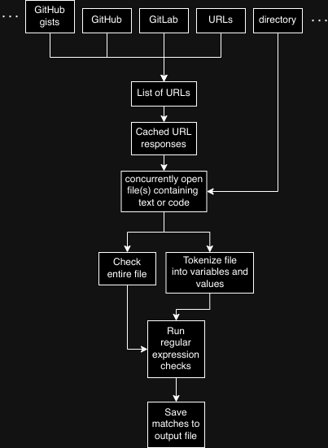
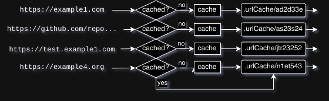
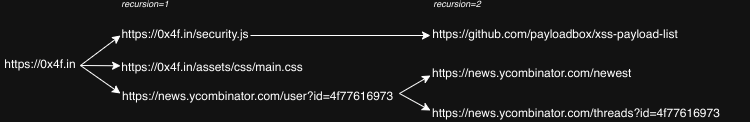
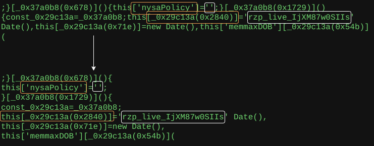
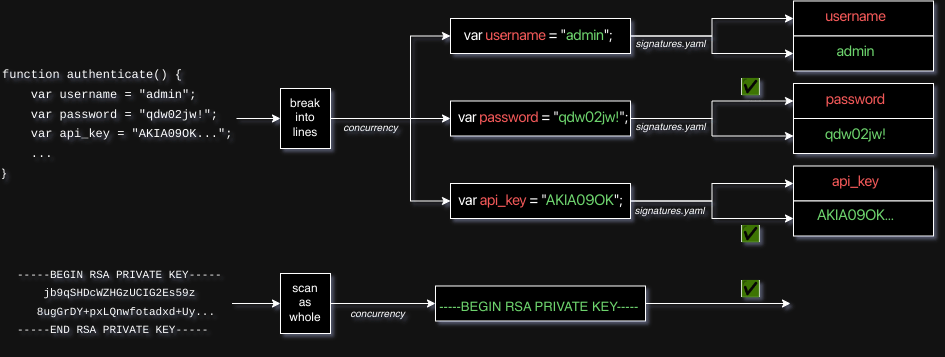
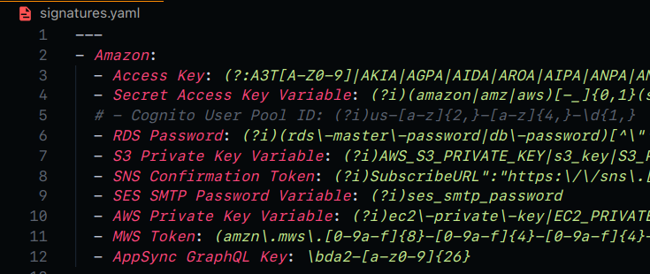

[](https://go.dev)
[](LICENSE)
[](https://github.com/0x4f53/secretsnitch/releases)

Presented at 

[](https://blackhatmea.com/blackhat-arsenal)


# Secretsnitch

A fast continuous secret scanner and endpoint extractor in Golang!


*(note: all the secrets in this document are censored since they're real*)

- **Continous scanning**: non-stop enumeration of scanning from several sources, helping organizations catch and secure accidental secret exposures. 

- **Concurrency**: lightning fast scanning with thousands of Goroutines - at once!

- **Modular design**: Supports GitHub, GitLab, Phishtank and random web scraping via flags.

- **Efficient networking**: reduced network usage with caching and instant output logging.

- **Comprehensive checks**: huge signature list for variable names, secret strings etc combined with metadata and entropy scoring.

- **User-friendly**: Designed for ease of use by pentesters, bounty hunters, or enterprise users via simple command-line execution.

- **Community-driven**: sourced from Google searches, ChatGPT, and open-source lists like GitGuardian.

- **Easy contribution**: Find a missing secret or blacklist regular expression? Simply make a pull request by following the [contribution guide](contributing.md)!

## Usage

```bash

❯ go build
❯ ./secretsnitch -h⠀⠀

Secretsnitch - A lightning-fast secret scanner in Golang!
https://github.com/0x4f53/secretsnitch
Copyright © 2024 Owais Shaikh

Usage:
./secretsnitch [input options] [output options]

Input (pick at least one):

  --github                  Scan public GitHub commits from the past hour
    --from                  (optional) Timestamp to start from (format: 2006-01-02-15)
    --to                    (optional) Timestamp to stop at (format: 2006-01-02-15)

  --github-gists            Scan the last 100 public GitHub Gists

  --gitlab                  Scan the last 100 public GitLab commits

  --phishtank               Scan reported phishtank.org URLs from the past day

  --url=<http://url>        A single URL to scan
  --urlList=<file>          A line-separated file containing a list of URLs to scan for secrets

  --directory=<directory/>  Scan an entire directory
  --file=<file.js>          Scan a file

Optional arguments:

  --output                  Save scan output to a custom location

  --workers                 Maximum number of workers to use (default: 5000)

  --recursions=<number>     Crawl URLs and hyperlinks inside targets (default: 0)

  --retries=<number>        Maximum retries before giving up (default: 3)

  --secrets-optional        Display other data (such as endpoints, domains etc.) even if there are no secrets

  --selenium                Scrape page using Selenium. This helps with pages that run client-side Javascript (note: this is slower)

pflag: help requested
```

### Examples

#### All GitHub commits in a range (GitHub module)

The GitHub module lets you search for secrets based on a commit timestamp. It generates patch files from a dataset that Gharchive hosts, then tries scraping those links.

GitHub uses something called "patch" files to keep track of changes that are made to repositories. These days, git has an in-built integration to prevent secret exposures. However, several secrets still slip by and some archived commits from the past may still contain secrets.

Lets say you would like to scan for commits from January 10, 2023 at 3 PM to January 15 2023 at 12 AM. You can run the below command

```bash
./secretsnitch --github --from=2024-01-10-15 --to=2024-01-15-0 --workers=20
```

Since the public GitHub API has rate limits, I recommend reducing the number of workers to strike the right balance between scraping commit files quickly and not exceed the official rate limit. Here, I chose 20, since it strikes the balance and doesn't breach the [80 content-generating requests per minute limit](https://docs.github.com/en/rest/using-the-rest-api/rate-limits-for-the-rest-api?apiVersion=2022-11-28).

This results in the following output

```bash
Secretsnitch - A lightning-fast secret scanner in Golang!
https://github.com/0x4f53/secretsnitch
Copyright © 2024 Owais Shaikh
Downloading and extracting non-concurrently...
JSON file .githubCommits//2024-10-31-13.json already exists. Continuing...
2024/10/31 20:31:40 Skipping https://github.com/cellatlas/human/commit/55f43f34ca277991e3a9b96a490999ea6e524d8b.patch as it is already cached at .urlCache/b65fb311.cache
2024/10/31 20:31:40 Skipping https://github.com/omarzydan610/Calculator_React-SpringBoot/commit/6b26bcd9f9e926dc5cc03cbd7f5cab01b966bced.patch as it is already cached at .urlCache/156e201d.cache
...

2024/10/31 20:32:30 
---

SECRET DETECTED:
    - Type:            Generic Password Variable
    - Variable Name:   password
    - Value:           Tes█████████
    - Position:        26:27
    - Source:          https://github.com/kal█████████████████████████████████████████████a8f37b12b061db16f5a13e.patch
    - Cached Location: .urlCache/674d3824.cache
    - Tags:            ["regexMatched"]
    - Tsallis Entropy: 0.843750
2024/10/31 20:32:30 Searching for secrets in: https://github.com/aaron-hwang/SRL/commit/d1e34fad5b7bdda6498ec5b6654323cbb0754c1a.patch (cached at: .urlCache/def4ec10.cache)
...
```

If you want to run the scan on just the last hour, simply run the command without the `from` and `to` flags.

```bash
./secretsnitch --github --workers=20
```

#### Single URLs

Say you have the following page:

https://0x4f.in

This page has a hardcoded OpenAI API Key in a Javascript file that it calls, named `security.js`. Simply running secretsnitch with the following command:

```bash
❯ go build
❯ ./secretsnitch --url=https://0x4f.in --recursions=1 --retries=0
```

Here, the `recursions` flag is set to `1`. This means that only the first layer of URLs within this page will be scanned, and not the URLs within those pages. `retries` being set to `0` means if a page can't be scraped, it will be left alone.

This gives you the following output:

```bash
2024/10/31 06:25:48 Content from https://0x4f.in saved to .urlCache/
2024/10/31 06:25:48 Searching for secrets in: https://0x4f.in (cached at: .urlCache/495c7d01.cache)
2024/10/31 06:25:50 Content from https://0x4f.in//assets/js/security.js saved to .urlCache/
2024/10/31 06:25:50 Content from https://play.google.com/store/apps/details?id=zeroxfourf.wristkey saved to .urlCache/
...
```

Once the pages are cached, the secret scanning begins.

```bash
...
2024/10/31 06:28:01 Searching for secrets in: https://0x4f.in//assets/js/security.js (cached at: .urlCache/bf212e67.cache)
2024/10/31 06:28:02 
---

SECRET DETECTED:
    - Type: OpenAI Service API Key
    - Variable Name: openAiApiKey
    - Value: sk-proj-█████████████████████████████████████████████
    - Position: 24:29
    - Source: https://0x4f.in/assets/js/security.js
    - Cached Location: .urlCache/0918b0a2.cache
    - Tags: ["regexMatched","providerDetected","longString"]
    - Tsallis Entropy: 0.979253

DOMAINS FOUND:
    - 1. 0x4f.in
    - 2. github.com

URLs FOUND:
    - 1. https://github.com/payloadbox/xss-payload-list
    - 2. https://0x4f.in/assets/images/ryanbeckford.gif
...
```

And thus, the secret is caught.

#### Stolen API Keys from phishing websites (Phishtank module)

Running secretsnitch with the following command:

```bash
./secretsnitch --phishtank
```

Grabs the latest URL archive from the Phishtank API. It then begins downloading and scraping all the pages from Phishtank first, post which the secret analysis begins.

### Components

#### Basic flow

The basic operation of the tool is as follows



#### Modules

##### Services

- **github**: Scan public GitHub commits from the past hour
  - (optional) **from**: Timestamp to start from (format: 2006-01-02-15)
  - (optional) **to**:   Timestamp to stop at (format: 2006-01-02-15)
- **github-gists**:      Scan the last 100 public GitHub Gists
- **gitlab**:            Scan the last 100 public GitLab commits
- **phishtank**:         Scan reported phishtank.org URLs from the past day

##### Miscelllaneous

- **url**:  A single URL to scan. *Tip: some URLs use client-side Javascript rendering (CSR). Use the `--selenium` flag to beat this and scraped rendered pages.*
- **urlList**:           A line-separated file containing a list of URLs to scan for secrets
- **directory**:         Scan an entire directory. *Tip: if you're bored waiting for pages to finish scraping, you can simply terminate the program and run it with `--directory=.urlCache/`* ;)
- **file**:              Scan a single file

You can also import the secretsnitch scanner as a golang package within your own security tools.

To do this, simply open your Go project and type

```bash
go get -u github.com/0x4f53/secretsnitch
```

#### Caching

This tool supports caching in order to save you some time. When a single URL or a list of URLs is supplied to the tool, each URL is sent to a worker. Each worker then scrapes and logs it to a patch file stored in `.urlCache/`. The named of each file is an MD5 hash of the URL in a primary-key like fashion, to make it easy to store, retrieve and detect the presence of pre-cached files without using a database.



This is quite useful in several scenarios, such as when starts are restarted with reduced workers if the tool crashes, or if the tool is restarted due to rate-limits being indefinite.

Although sometimes, this caching feature can interfere with your use of this tool, for example, while bounty hunting. To fix this, simply delete the `.urlCache/` directory and start the tool again.

#### Tunables

Secretsnitch is extremely tunable via for different use cases, whether its the worker count to prevent slowdowns on older devices, or the output destination for logshipping via tools like Filebeat.

Tunables available:

- **output**: Save scan output to a custom location. Directories and subdirectories will be created if they don't exist.

- **workers**: The amount of workers that can run each operation concurrently. This should be set according to hardware factors like CPU threads, rate-limits etc. When you're bruteforcing a large list of URLs or a directory on a powerful server, set this number to a high number.



- **recursions**: Crawl URLs inside files, then crawl the URLs inside those URLs, then the URLs in the URLs in the URLs, then the URLs in the URLs in the URLs in the URLs, then... you get the point.

- **retries**: Give up after trying so many times. Useful if the destination is misbehaving or crashing.

- **secrets-optional**: Display other data such as URLs and domains even if there are no secrets. Useful for asset extraction.

- **selenium**: If a site uses client-side rendering (CSR), you can use the Selenium plugin to have the Javascript be rendered first, then extract secrets from it. Please note that Docker needs to be installed for this to work.

#### Scanning

#### Tokenization



When a file containing code is passed to the tool, it uses tokenization techniques via in-built regular expressions, string splitting and so on.

These techniques are tested and optimized for codebases of languages commonly used with backend development, such as

- Javascript
- Golang
- Bash
- Python
- Java
- etc.

There is also support for common structured file formats such as

- JSON
- env
- XML
- HTML
- etc.

#### Parsing



Secretsnitch looks for two classifications of secrets:

1. Single secrets: These include
    - API Keys
    - Password strings
    - URLs with leaked authentication (such as `mysql://` connection strings)

2. Secret files: These include
    - SSH Private Keys
    - `.pem` files
  
In addition to the above, the tool also looks for other assets that could work in conjunction with the secrets. This includes

- URLs: These may be URLs for things like S3 storage, documentation, or may contain PII.

- Domains These are domains that the tool captures and validates with the system's DNS resolvers. This is especially useful for correlating secrets with a particular organization.

#### Detection

_Further reading: [contributing](contributing.md)



Detection uses two signature files supplied with the tool.

- `signatures.yaml`
This file contains a list of regular expressions that the tool uses to catch secrets. They are sorted by the service provider (Amazon, Microsoft etc.) and the service they provide (e.g.: SQS, SharePoint etc.)

    It contains two classifications of regular expressions:

  - Variable patterns: These are patterns that are used to check for variable names where the secret may not have a recognizable pattern (for example, passwords). These are marked by the usage of the word `Variable` at the end of the signature's key.

  - Secret patterns: these are patterns that are commonly used by secrets, for example, `AIza...` for GCP keys, `AKIA` for AWS keys and so on.

  - Block patterns: these are patterns that commonly exist in large blocks of text, for example, private key files.

- `blacklist.yaml`
This file contains a list of blacklist patterns that are skipped. These include things like blob data patterns for images and audio, certain placeholderstrings etc.

These files are parsed, then the compiled patterns are matched against variable names and values using Golang's `regexp` library in a loop. The result from the `FindSecrets()` function is returned as a slice of `ToolData` and is logged immediately.

## Troubleshooting and tips

### False positives and false negatives

Some false positive secrets simply cannot be mitigated. Others, however, can be improved through continuous improvement of the signatures list and the algorithms. False negatives may also occur if the secret patterns are too strict.

If you have any ideas to prevent false positives and false negatives, please [raise an issue](https://github.com/0x4f53/secretsnitch/issues) or [contribute](contributing.md) to the project.

### URL Cache contains data that's too old

Sometimes, caching can interfere with your use of this tool with outdated or inaccurate data. To fix this, simply delete the `.urlCache/` directory and start the tool again.

### GitHub rate limits

If your worker count is above GitHub's permitted public API limits, blasting multiple queries will result in an error `429` and a rate-limit. To prevent this, simply set the `workers` flag to 100 or a lower number. This trick also works with the URL list option if the source URLs have rate-limiting enabled.

### Tool stops instantly

Sometimes, the tool just stops as soon as it is started. This is due to a bug with the concurrency. Simply re-run the tool a few times if this happens.

### Selenium mode

If you receive a message like the one below on Linux

```bash
Error creating container: Post "http://unix.sock/containers/create?": dial unix /var/run/docker.sock: connect: permission denied
```

Simply run

```bash
sudo usermod -aG docker $USER
newgrp docker
```

And try again.

For Windows, try the following

1. Open Docker Desktop Settings
2. Right-click the Docker icon in the system tray and select Settings.
3. Enable the TCP Endpoint
4. Go to the General or Resources > Advanced settings (the exact menu depends on the Docker Desktop version).
5. Look for an option to Expose daemon on tcp://localhost:2375 without TLS.
6. Enable this option if you’re okay with using an insecure endpoint, or set up certificates for localhost:2376 if you prefer TLS.
7. Go to the `dockerSelenium.go` file and replace `unix:///var/run/docker.sock` with `http://localhost:2375`.

If you can successfully build the docker image manually but can't trigger it via secretsnitch, try running the tool as superuser via `sudo`.

## Contribution

This tool needs contributors to grow and become extremely versatile and powerful. Please read the [contributing documentation](contributing.md) if you'd like to contribute.

## Acknowledgements

- [GitGuardian](https://docs.gitguardian.com/secrets-detection/secrets-detection-engine/detectors/supported_credentials), for their extensive regular expressions list. Can't thank them enough for kickstarting this.
- [GitSecrets](https://github.com/awslabs/git-secrets)
- [Secretsearch](https://gitlab.com/redhuntlabs/secretsearch), the predecessor of this project. I do not maintain it anymore.

## License

Multimedia licensed under [](https://creativecommons.org/licenses/by-nc-sa/4.0/)

[Copyright © 2024 Owais Shaikh](LICENSE)

## Donate

If you'd like to donate to me, [visit my GitHub page](https://github.com/0x4f53). It incentivizes me to develop more.
